<div align="center">
  
</div>
<!-- 2. The Typewriter Animation -->
  

</div>

<div align="center">
  
  <!-- The Badges -->
  <a href="https://github.com/primegideon">
    
  </a>
  <a href="https://github.com/primegideon?tab=followers">
    
  </a>
  <br>
  <a href="https://www.linkedin.com/in/gideon-amoah09/">
    
  </a>


  <!-- The Glowing Divider -->
  

</div>

<h2 align="center">About Me</h2>

```yaml
name:       Gideon Amoah
role:       Actuarial Science Student & Data/Cloud Enthusiast 
education:  University of Cape Coast · BSc Actuarial Science · Level 400
latest:     Architected a cloud-integrated insurance risk evaluation system
building:   ML Fare Predictor · Ride-and-Share Analytics Pipeline
learning:   AWS Cloud Infrastructure Foundations · Full-Stack Development
mission:    Bridging actuarial math and complex risk with scalable, data-driven architecture
location:   Accra, Ghana (GMT)
contact:    gideon.owusu006@stu.ucc.edu.gh
```
* **Recently built** a **Cloud-Integrated Insurance Risk Evaluation System** utilizing FastAPI, Streamlit, Supabase, and IBM Watsonx.ai Granite models.
* **Just shipped** a **Machine Learning Fare Predictor** and a Ride-and-Share data analytics pipeline leveraging BigQuery and Python.
* **Currently mastering** **AWS Cloud Infrastructure Foundations** and full-stack development through IBM SkillsBuild and Udacity.
* **Previously** interned in Data Analytics at **Thrive Africa** and Operations at **Prudential Life Insurance**.
* **Leadership** Former Co-Lead for the **TEDxUniversityofCapeCoast** Kintsugi event.
* **Ask me about** Actuarial Science, data architecture, cloud foundations, and the Ghanaian tech scene.
 <!-- The Glowing Divider -->
  
  <br>
<h3 align="center">Featured Learning & Certifications</h3>

| &nbsp; | &nbsp; |
| :--- | :--- |
| 📚 **Google Data Analytics Certificate** <br> *Google Career Certificate* <br><br> End-to-end data processing, from rigorous cleaning and transformation to advanced visualization and reporting. <br><br> <sub>`Data Cleaning` · `SQL` · `Tableau` · `R`</sub> | 📌 **IBM Data Analytics Certificate** <br> *IBM Certificate Program* <br><br> Applied statistical analysis, data-driven decision making, and building advanced analytical workflows. <br><br> <sub>`Python` · `Excel` · `Data Visualization` · `Cognos`</sub> |
| 💻 **Fullstack Development (Python)** <br> *STARTOCODE - One Million Coders Programme* <br><br> Architecting robust, scalable backend systems and integrating full-stack web applications. <br><br> <sub>`Python` · `FastAPI` · `Backend Architecture` · `Git`</sub> | ☁️ **Future AWS Agentic AI Business Professional** <br> *AWS AI & ML Scholars Program* <br><br> Mastering core AWS cloud infrastructure foundations, focusing strictly on scalable networking, compute, and storage architecture. <br><br> <sub>`Cloud Infrastructure` · `AWS EC2` · `AWS S3` · `IAM`</sub> |
<p align="center">
  More on <a href="https://www.linkedin.com/in/gideon-amoah09/">LinkedIn</a>
</p>
 <!-- The Glowing Divider -->
  

 <br>
<h3 align="center">Tech Stack & Tools</h3>

<div align="center">
  <table>
    <tr>
      <td align="center" width="150"><b>Languages</b></td>
      <td>
        <!-- Square Tiles -->
        
      </td>
    </tr>
    <tr>
      <td align="center"><b>Data & Cloud</b></td>
      <td>
        <!-- Square Tiles -->
        
        <!-- Rectangular Badge -->
        
      </td>
    </tr>
    <tr>
      <td align="center"><b>Web & Backend</b></td>
      <td>
        <!-- Square Tiles -->
        
        <!-- Rectangular Badge -->
        
      </td>
    </tr>
    <tr>
      <td align="center"><b>AI & Analytics</b></td>
      <td>
        <!-- Rectangular Badges -->
        
        
        
      </td>
    </tr>
    <tr>
      <td align="center"><b>Tools</b></td>
      <td>
        <!-- Square Tiles -->
        
      </td>
    </tr>
  </table>
</div>
  <br><br>

<div align="center">
  <!-- Top Flux Divider -->
  
  
  <br><br>
  
  <h3>Commit Chronicles</h3>
  
  <br>

  <!-- Live GitHub Streak Card -->
  <a href="https://github.com/primegideon">
    
  </a>

  <br><br>
  
  <!-- Bottom Flux Divider -->
  
</div>

<br>

<div align="center">
  <h3>DevPulse Activity</h3>
  
  <br>

  <!-- Live Contribution Graph -->
  <a href="https://github.com/primegideon">
  
</a>
</div>

<br><br>
  <!-- Bottom Flux Divider -->
  

  <br>

<div align="center">
  <h3>Watch My Commits Vanish Into Oblivion</h3>
  
  <br>

  <!-- Animated Contribution Snake -->
  <picture>
    <source media="(prefers-color-scheme: dark)" srcset="https://raw.githubusercontent.com/primegideon/primegideon/output/github-snake-dark.svg">
    <source media="(prefers-color-scheme: light)" srcset="https://raw.githubusercontent.com/primegideon/primegideon/output/github-snake.svg">
    
  </picture>
</div>

<br><br>
  <!-- Bottom Flux Divider -->
  

  <br><br>

<div align="center">
  <h3>Let's Connect</h3>
  <br>
  <!-- Social Badges -->
  <a href="https://www.linkedin.com/in/gideon-amoah09/">
    
  </a>
  <a href="mailto:gideon.owusu006@stu.ucc.edu.gh">
    
  </a>
  <a href="https://www.instagram.com/jst.achillguy/">
    
  </a>
  <a href="https://discord.com/channels/@me">
    
  </a>
<br><br>
  <!-- Bottom Flux Divider -->
   

  <br>

<div align="center">
  <!-- Dynamic Cyberpunk Quote Generator -->
  <a href="https://github.com/piyushsuthar/github-readme-quotes">
    
  </a>
</div>
<br><br>

<div align="center">
  <!-- Interactive Wavy SVG Banner -->
  
  
  <br><br>

  <!-- Credit & Attribution -->
  <p style="font-size: 0.85em;">
    Credit: Inspired by <a href="https://github.com/stephensookra">@stephensookra</a>
  </p>
  
  <p style="font-size: 0.8em;">
    Built by <a href="https://github.com/primegideon">@primegideonn</a> · Amrahia, Ghana · <i> working at the intersection of numbers and tech</i>
  </p>
  
  <p style="color: #79C0FF; font-size: 0.7em;">
    Last edited: August 2026
  </p>
</div>

<br>